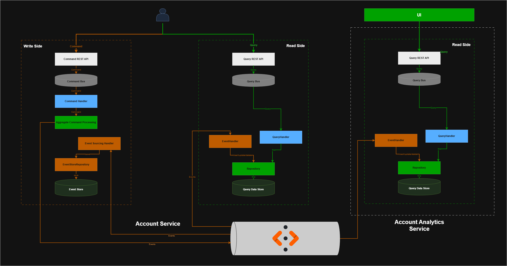
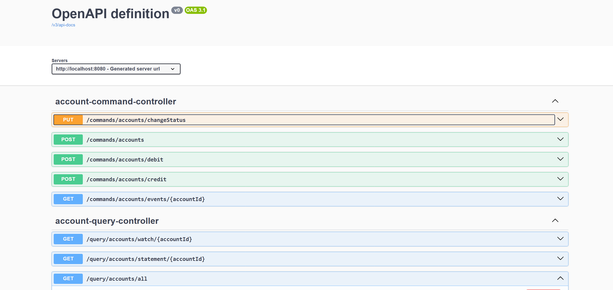
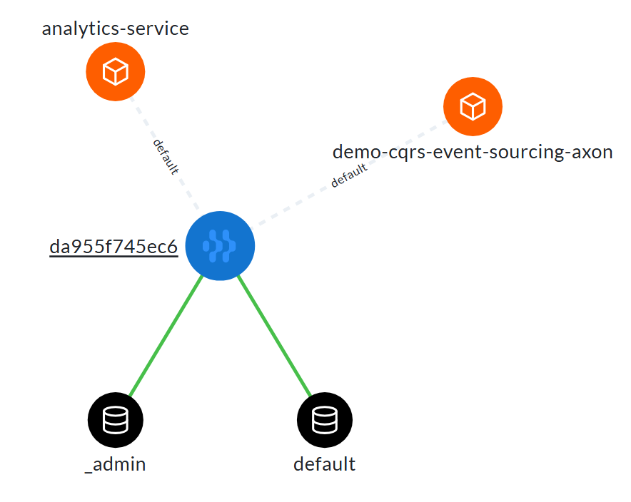
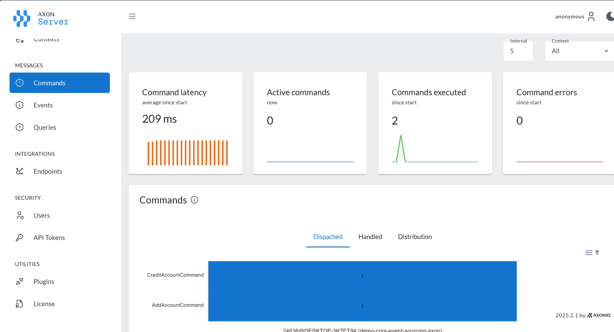
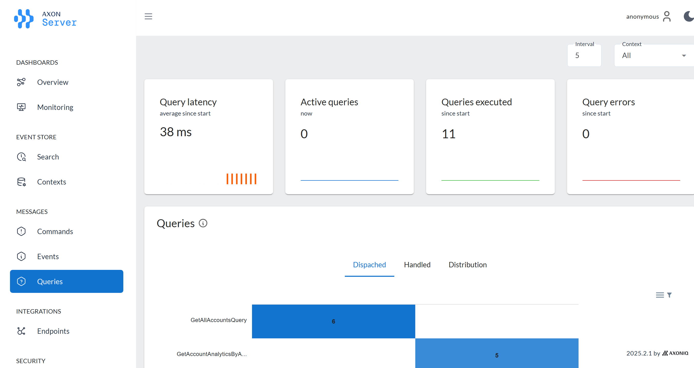
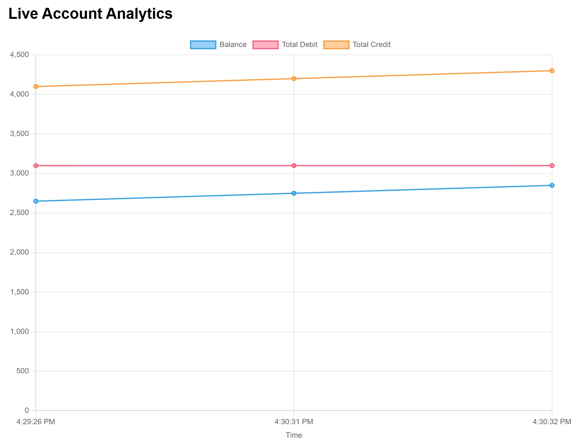

# Microservice Application with Event Sourcing and CQRS using Axon

## Overview

This project demonstrates a modern microservices architecture using **Event Sourcing** and **CQRS** patterns. The system is built with **Spring Boot** and leverages the **Axon Framework** and **Axon Server** to handle message routing and event storage.

## Technical Concepts

### What is Event Sourcing (ES)?

Event Sourcing is an architectural pattern where state changes are stored as a sequence of immutable events rather than just saving the current state of an entity.

* **Persistence:** Instead of updating a row in a database, every action (e.g., "AccountOpened", "MoneyDeposited") is appended to an Event Store.
* **State Reconstruction:** The current state of an aggregate is reconstructed by replaying these events in chronological order.
* **Audit Trail:** It provides a 100% accurate history of how the current state was reached.

### What is CQRS?

CQRS (Command Query Responsibility Segregation) is a pattern that separates the models for reading and writing data.

* **Command Side:** Handles the "intent" to change data. It focuses on business logic and validation.
* **Query Side:** Handles data retrieval. It uses projections (read models) that are optimized for specific UI or analytical requirements.
* **Synchronization:** The two sides are synchronized via events published by the command side.

## Frameworks and Tools

### What is Axon?

Axon is a specialized Java framework designed to simplify the implementation of CQRS and Event Sourcing.

* **Axon Framework:** Provides the building blocks like Aggregates, Command Handlers, and Event Processors.
* **Axon Server:** Acts as a dedicated **Event Store** and a **Message Router**. It handles the distribution of Commands, Events, and Queries across different microservices.

## System Architecture

Below is the detailed architecture diagram illustrating the CQRS and Event Sourcing implementation:

### 1. Account-Service

This service manages the lifecycle of bank accounts and serves as the primary entry point for state changes.

Here is the docs using Swagger docs:

### 2. Account-Analytics-Service

This service consumes events to provide real-time insights and data analysis without impacting the performance of the main account service.

## Screenshots

Below are some screenshots showcasing the application:

### Axon Server Applications View

### Axon Server Dashboards

#### Commands Dashboard

#### Queries Dashboard

### Account Analytics

#### Chart Before Update

#### Chart After Update

